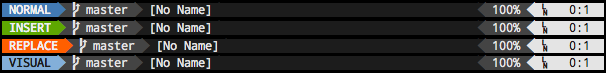

# lightline-wtf

lightline-wtf is a [lightline.vim](https://github.com/itchyny/lightline.vim)
color scheme based on [Whiskey Tango Focus](https://github.com/sstallion/vim-wtf).

## Installation

_lightline-wtf depends on the [lightline.vim](https://github.com/itchyny/lightline.vim)
and [vim-wtf](https://github.com/sstallion/vim-wtf) plugins, which should be
installed first using one of the documented methods._

This plugin is compatible with several popular plugin managers:

### Pathogen

    git clone git://github.com/sstallion/lightline-wtf.git ~/.vim/bundle/lightline-wtf

### Vundle

Add the following to your `.vimrc` and execute the `:PluginInstall` command:

    Plugin 'sstallion/lightline-wtf'

### NeoBundle

Add the following to your `.vimrc` and execute the `:NeoBundleInstall` command:

    NeoBundle 'sstallion/lightline-wtf'

### vim-plug

Add the following to your `.vimrc` and execute the `:PlugInstall` command:

    Plug 'sstallion/lightline-wtf'

## Configuration

To enable this color scheme, simply add the following to your `.vimrc`:

    let g:lightline = {
          \ 'colorscheme': 'wtf',
          \ }

### Vertical Splits

lightline incorrectly calculates the width of the window when a vertical split
is present, which results in improper highlighting (see issue
[#179](https://github.com/itchyny/lightline.vim/issues/179)). To work around
this issue, the following function call should be added to `.vimrc` after
lightline is configured:

    call lightline#colorscheme#wtf#highlight()

A more complete example configuration can be found
[here](https://github.com/sstallion/dotfiles/blob/master/files/vim/after/plugin/lightline.vim).

## Thanks

Thanks to [Ben Ridder](https://github.com/brridder) for testing changes,
providing great feedback, and stoically dealing with my penchant for amended
commits.
